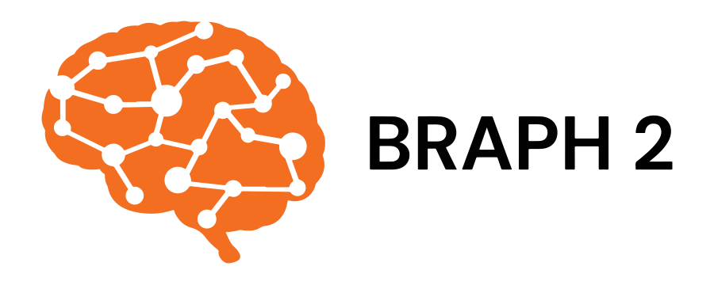

[](https://braph2software.bsky.social)
[](https://twitter.com/braph2software)
[](https://doi.org/10.1101/2025.10.07.680053)

# BRAPH 2 DeepBone

**BRAPH 2 DeepBone** provides a *variational autoencoder (VAE)* pipeline for **unsupervised decoding of 3D bone-marrow microenvironments** from deep imaging data.

This repository focuses on the **analysis side only**: the VAE-based “niche decoding” workflow.

The pipeline implements the deep-learning approach introduced in:

> Chu et al., *Quantitative Multicolored Deep Imaging of Human Bones Reveals a Composite Osteo-Sinusoidal Niche for Mesenchymal Stromal Cells* (bioRxiv, 2025).  
> DOI: https://doi.org/10.1101/2025.10.07.680053 

This distribution reuses the core infrastructure of the standard BRAPH 2 distribution. For a general introduction to BRAPH 2, please refer to the main BRAPH 2 repository and its tutorials.

## What the pipeline does

From multichannel 3D images, the method converts local neighbourhoods around **CXCL12+ stromal cells** into **radial distribution functions** that quantify proximity to key structures (bone, sinusoids, other CXCL12+ cells) within **0–200 μm** (10 μm increments), giving **63 values per cell**. These vectors are embedded into a **2D latent space** using a VAE, enabling unsupervised grouping of cells by microenvironment and “decoding” of representative niche patterns (e.g., an osteo-sinusoidal niche enriched in both bone and sinusoids, prominent in young samples).

<p align="center">
  
</p>

> **Niche decoding via VAE (Figure 7 in Chu et al.)**  
> A schematic of: (i) constructing per-cell radial functions; (ii) encoding into a 2D latent space; and (iii) decoding selected regions to interpret microenvironments (young vs aged; regions R3/R4/R5). 

## Folder structure

The DeepBone analysis pipeline is organised under:

- `braph2deepbone/pipelines/VariationalAutoencoder/`

## Model details (as in the paper)

The VAE used in the paper is a compact fully-connected architecture:

- **Input:** 63 features (3 functions × 21 radius points) 
- **Encoder:** 63 → 16 → LeakyReLU(0.2) → 4 → 2D latent
- **Decoder:** mirrors the encoder back to 63 outputs
- **Training objective:** ELBO = reconstruction loss (MSE) + KL divergence(sediment://file_00000000738c722fbfab02dd7c9d7b24)  

## Software requirements

To run **BRAPH 2 DeepBone**, you need:

### MATLAB
- MATLAB (R2022a or later recommended)
- Toolboxes:
  - **Statistics and Machine Learning Toolbox**
  - **Deep Learning Toolbox**
  - **Parallel Computing Toolbox** (optional, but useful)

## Software compilation

The compiled version of this distribution is already included in this repository under the braph2distap folder. However, if you extend the pipelines (for example, by adding new studies or altering the VAE architecture) you may wish to recompile.
You can recompile DiSTAP using the BRAPH 2 Genesis mechanism. In MATLAB:
```
% Example – adapt the configuration filename to your setup
braph2genesis('braph2distap_config.m');
```
This will re-generate the braph2distap folder with the updated elements and GUIs.
Warning:
Before recompiling, remove the existing braph2distap folder and take it off the MATLAB path to avoid conflicts. The folder will be recreated after a successful compilation.

## Citing

If you use BRAPH 2 DiSTAP in your work, please cite:

> Chu et al., *Quantitative Multicolored Deep Imaging of Human Bones Reveals a Composite Osteo-Sinusoidal Niche for Mesenchymal Stromal Cells* (bioRxiv, 2025).  
> DOI: https://doi.org/10.1101/2025.10.07.680053 

> Chang et al., *BRAPH 2: a flexible, open-source, reproducible, community-oriented, easy-to-use framework for network analyses in neurosciences* (preprint).
> [biorXiv:10.1101/2025.04.11.648455](https://doi.org/10.1101/2025.04.11.648455)
